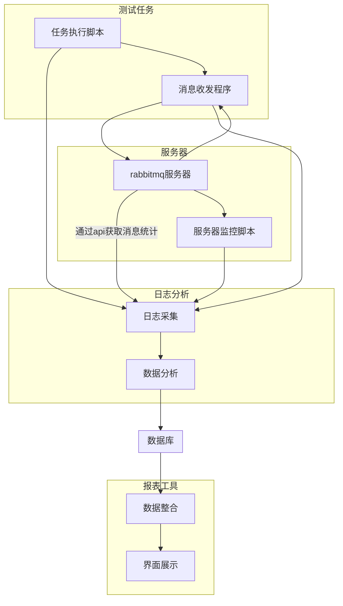
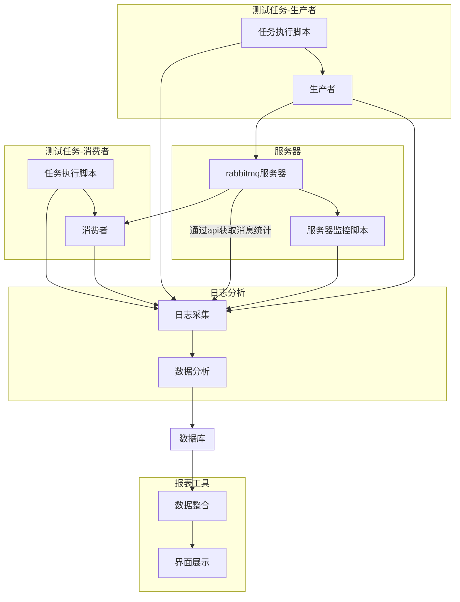

# 1. 功能分析

​		rabbitmq测试集成工具需完成官方测试工具测试和mo_librabbitmq库测试，官方测试工具和mo_librabbitmq需进行对比测试。

​		rabbitmq服务器需进行崩溃模拟测试，集群需进行脑裂测试。

​		测试工具需可以根据测试计划自动顺序执行测试任务并输出测试报告。

## 1.1 任务脚本功能

   - 动态设置消息发送速率

   - 动态设置消息大小

   - 动态设置生产者消费者数量

   - queue动态设置

   - 自定义消息属性

   - 自定义exchange、queue、routing-key

   - 自定义prefetch

   - 定时爬取rabbitmq服务器统计数据

   - 自动执行测试任务

## 1.2 监控脚本功能

- 监控rabbitmq服务器cpu使用率

- 监控rabbitmq服务器内存使用数量

- 监控rabbitmq服务器磁盘空间占用大小

- 监控rabbitmq服务器进程状态

- 服务器崩溃模拟

- 监控服务器信息统计(cpu/内存/磁盘)

## 1.3 报表生成功能

- 日志分析

- 数据整合

- html报表生成

## 1.4 mo_librabbimq库测试程序

- exchange、queue、routing-key参数设置
- 消息参数设置
- 消息大小设置
- 发送速率设置
- prefetch设置
- 发送时长设置

# 2 系统设计

## 2.1 程序组织


## 2.1 测试计划配置格式

配置文件采用yaml格式：

``` yaml
# 每项任务间隔, 确保上一项测试已经结束，服务器负载恢复正常
duration: 60
# rabbitmq服务器地址
url: amqp://localhost:5671
# 是否生产者和消费者在同一台机器, 如果生产者和消费者不在同一台机器，task_list则只可以配置一项测试任务
# 并且需要在不同机器上执行测试任务脚本
same-machine: true
# 任务列表
task_list:
  -
  	# 测试时长 秒
    time: 300
    # 生产者和消费者在不同机器上时，此参数生效
    routing-key: keda.test.k
    # exchange列表
    exchanges: 
      -
        # exchange名称
        name: keda.exchg.test1
        # exchange类型
        type: topic
		# 消费者自动确认
        auto-ack: true
        # 一次确认多个消息
        multi-ack: 100
        # 持久化消息和队列
        persistent: true
        # 消息预取
        prefetch: 500
        # 消费者速率 msg/s, 每个消费者都是这个速率
        consumer-rate: 500
        # 发送速率 msg/s，每个消费者都是这个速率
        publisher-rate: 20000
        # 消息大小
        msg-size:
          -
            # 发送消息大小1000字节，持续发送5秒
            # 持续时间
            duration: 5
            size: 1000
          -
            duration: 10
            size: 2000
          -
            duration: 15
            size: 3000
        # 消息属性，key-value形式
        msg-properties:
          # 例子：优先级属性
          priority：10
        # 单个队列
        queue:
          # 队列名
          name: keda.test.q
          # 生产者数量
          producter: 2
          # 消费者数量
          consumer: 4
  -
    time: 100
    exchanges:
      -
        # exchange名称
        name: keda.exchg.test2
        # exchange类型
        type: topic
		# 消费者自动确认
        auto-ack: true
        # 一次确认多个消息
        multi-ack: 100
        # 持久化消息和队列
        persistent: false
        # 消息预取
        prefetch: 1
        # 消费者速率 msg/s, 每个消费者都是这个速率
        consumer-rate: 500
        # 发送速率 msg/s，每个消费者都是这个速率
        publisher-rate:
          -
            # 发送间隔5秒，发送速率 1000 msg/s
            duration: 5
            rate: 1000
        # 多队列
        queues:
          # 队列生成规则，将从 perf-test-1 到perf-test-10
          pattern：perf-test-%d
          from: 1
          to: 10
          # 生产者和消费者会均衡到所有队列
          # 总的生产者数量
          producter: 100
          # 总的消费者数量
          consumer: 100
```


> 上述配置文件模板生产者消费者在同一台机器上，如果生产者和消费者在不同机器上，task_list只能有一项测试任务。
>

## 2.2 生产者消费者单机执行流程


> 消息收发程序为rabbitmq官方测试工具或者mo_librabbitmq库测试程序
## 2.3 生产者消费者双机执行流程

> 生产者和消费者同单机模式的消息收发程序一样，是rabbitmq官方测试程序或者mo_librabbitmq库测试程序，不同之处为作为两个角色运行于不同进程。

# 3 模块设计

## 3.1 测试任务执行脚本

测试任务执行脚本需要解析任务配置文件，配置文件为yaml格式。

 ```flow
 st=>start: 开始
 e=>end: 结束
 readarg=>operation: 解析命令参数
 readcfg=>operation: 解析配置文件
 buildcmd=>operation: 构造命令行参数
 execcmd=>operation: 执行命令
 sub1=>subroutine: 进入双机流程
 cond=>condition: 是否单机测试模式
 io=>inputoutput: 发送日志到日志分析程序
 st->readarg->readcfg->cond
 cond(yes)->buildcmd->execcmd->io->e
 cond(no)->sub1(right)
 ```
> 双机流程为一端是生产者，一端是消费者

**下面是双机流程**

 ```flow
 st=>subroutine: 双机流程
 e=>end: 结束
 buildprod=>operation: 构造生产者命令参数
 buildcons=>operation: 构造消费者命令参数
 execcmd=>operation: 执行命令
 io=>inputoutput: 发送日志到日志分析程序
 cond=>condition: 是否生产者
 st->cond
 cond(yes)->buildprod->execcmd->io
 cond(no)->buildcons->execcmd->io->e
 ```
> 脚本命令中会指定一个参数，指明角色是作为生产者还是消费者
## 3.2 服务器监控脚本

### 3.2.1 监控命令

**监控rabbitmq进程CPU和内存使用情况**

```bash
louis@louis:~$ ps -e -o 'pid,comm,args,pcpu,rsz,vsz,stime,user,uid' | grep rabbitmq | grep beam
 1920 beam.smp        /usr/lib/erlang/erts-7.3/bi  2.9 61228 4344380 09:48 rabbitmq  125
```

> 上述显示的结果中，1920为进程id，2.9为CPU使用率百分比，61228为内存使用，单位KB。

**监控系统CPU使用情况**

```bash
louis@louis:/etc/init.d$ vmstat 
procs -----------memory---------- ---swap-- -----io---- -system-- ------cpu-----
 r  b   swpd   free   buff  cache   si   so    bi    bo   in   cs us sy id wa st
 1  0      0 308588 732068 13012928    0    0    54    50   45   95  1 11 87  1  0
```

> us+sy为cpu使用率

**监控系统内存使用情况**

```bash
louis@louis:~$ free
              total        used        free      shared  buff/cache   available
Mem:       16286124     2301288      262444     4710788    13722392     8870604
Swap:             0           0           0
```

> used/total为内存使用率，free为未使用内存，buff/cache为缓存。

服务器监控脚本需要监控rabbitmq服务器和物理服务器的资源使用情况。

```flow
st=>start: 开始
e=>end: 结束
rmqcpu=>operation: 
st->e
```

## 3.3 日志分析脚本


## 3.4 报表生成工具


## 3.5 mo_librabbitmq测试程序


## 3.6 数据库初始化脚本


# 4 使用方法


# 5  注意事项


