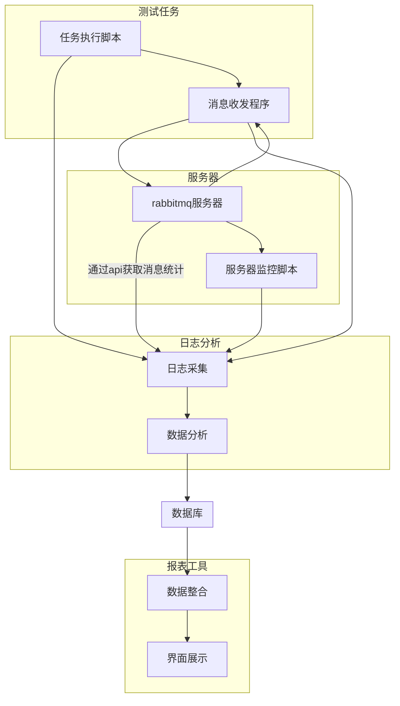
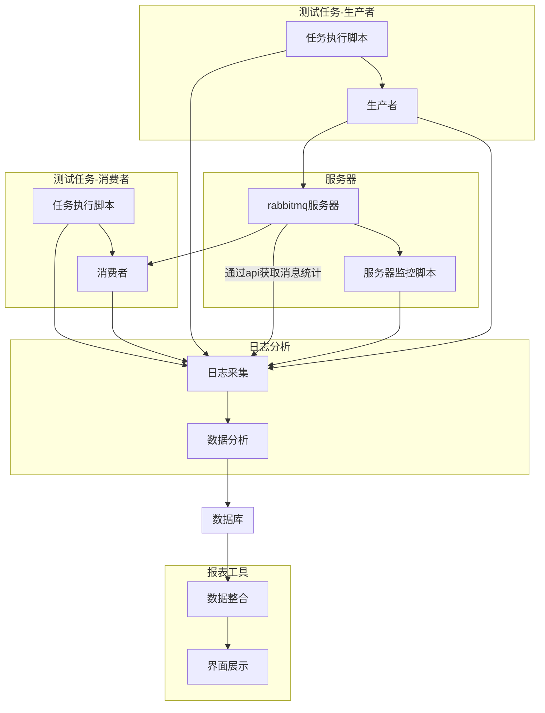

# 1. 功能分析

​		rabbitmq测试集成工具需完成官方测试工具测试和mo_librabbitmq库测试，官方测试工具和mo_librabbitmq需进行对比测试。

​		rabbitmq服务器需进行崩溃模拟测试，集群需进行脑裂测试。

​		测试工具需可以根据测试计划自动顺序执行测试任务并输出测试报告。

## 1.1 任务脚本功能

   - 动态设置消息发送速率

   - 动态设置消息大小

   - 动态设置生产者消费者数量

   - queue动态设置

   - 自定义消息属性

   - 自定义exchange、queue、routing-key

   - 自定义prefetch

   - 定时爬取rabbitmq服务器统计数据

   - 自动执行测试任务

## 1.2 监控脚本功能

- 监控rabbitmq服务器cpu使用率

- 监控rabbitmq服务器内存使用数量

- 监控rabbitmq服务器磁盘空间占用大小

- 监控rabbitmq服务器进程状态

- 监控服务器信息统计(cpu/内存/磁盘)

## 1.3 报表生成功能

- 日志分析

- 数据整合

- html报表生成

## 1.4 mo_librabbimq库测试程序

- exchange、queue、routing-key参数设置
- 消息参数设置
- 消息大小设置
- 发送速率设置
- prefetch设置
- 发送时长设置

# 2 系统设计

## 2.1 程序组织


## 2.1 测试计划配置格式

配置文件采用yaml格式：

``` yaml
# 每项任务间隔, 确保上一项测试已经结束，服务器负载恢复正常
duration: 60
# rabbitmq服务器地址
url: amqp://localhost:5671
# 任务列表
task_list:
  -
  	# 测试时长 秒
    time: 300
    # 生产者和消费者在不同机器上时，此参数生效
    routing-key: keda.test.k
    # exchange
    exchange: test.rmq.ex
	# 消费者自动确认
    auto-ack: true
    # 一次确认多个消息
    multi-ack: 100
    # 持久化消息和队列
    persistent: true
    # 消息预取
    prefetch: 500
    # 消费者速率 msg/s, 每个消费者都是这个速率
    consumer-rate: 500
    # 发送速率 msg/s，每个消费者都是这个速率
    productor-rate: 20000
    # 消息大小
    msg-size:
      -
        # 发送消息大小1000字节，持续发送5秒
        # 持续时间
        duration: 5
        size: 1000
      -
        duration: 10
        size: 2000
      -
        duration: 15
        size: 3000
    # 消息属性，key-value形式
    msg-properties:
      # 例子：优先级属性
      priority：10
    # 单个队列
    queue:
      # 队列名
      name: keda.test.q
      # 生产者数量
      producter: 2
      # 消费者数量
      consumer: 4
  -
    time: 100
    exchange: keda.exchg.test2
    # 消费者自动确认
    auto-ack: true
    # 一次确认多个消息
    multi-ack: 100
    # 持久化消息和队列
    persistent: false
    # 消息预取
    prefetch: 1
    # 消费者速率 msg/s, 每个消费者都是这个速率
    consumer-rate: 500
    # 发送速率 msg/s，每个消费者都是这个速率
    productor-rate:
      - # 发送间隔5秒，发送速率 1000 msg/s
        duration: 5
        rate: 1000
    # 多队列
    queues:
      # 队列生成规则，将从 perf-test-1 到perf-test-10
      pattern：perf-test-%d
      from: 1
      to: 10
      # 生产者和消费者会均衡到所有队列
      # 总的生产者数量
      producter: 100
      # 总的消费者数量
      consumer: 100
```


> 上述配置文件模板生产者消费者在同一台机器上，如果生产者和消费者在不同机器上，task_list只能有一项测试任务。
>

## 2.2 生产者消费者单机执行流程


> 消息收发程序为rabbitmq官方测试工具或者mo_librabbitmq库测试程序
## 2.3 生产者消费者双机执行流程

> 生产者和消费者同单机模式的消息收发程序一样，是rabbitmq官方测试程序或者mo_librabbitmq库测试程序，不同之处为作为两个角色运行于不同进程。

# 3 模块设计

## 3.1 测试任务执行脚本

测试任务执行脚本需要解析任务配置文件，配置文件为yaml格式。

 ```flow
 st=>start: 开始
 e=>end: 结束
 readarg=>operation: 解析命令参数
 readcfg=>operation: 解析配置文件
 buildcmd=>operation: 构造命令行参数
 execcmd=>operation: 执行命令
 sub1=>subroutine: 进入双机流程
 cond=>condition: 是否单机测试模式
 io=>inputoutput: 发送日志到日志分析程序
 st->readarg->readcfg->cond
 cond(yes)->buildcmd->execcmd->io->e
 cond(no)->sub1(right)
 ```
> 双机流程为一端是生产者，一端是消费者

**下面是双机流程**

 ```flow
 st=>subroutine: 双机流程
 e=>end: 结束
 buildprod=>operation: 构造生产者命令参数
 buildcons=>operation: 构造消费者命令参数
 execcmd=>operation: 执行命令
 io=>inputoutput: 发送日志到日志分析程序
 cond=>condition: 是否生产者
 st->cond
 cond(yes)->buildprod->execcmd->io
 cond(no)->buildcons->execcmd->io->e
 ```
> 脚本命令中会指定一个参数，指明角色是作为生产者还是消费者
## 3.2 服务器监控脚本

> 服务器监控采用python psutil库。


```flow

st=>start: 开始
e=>end: 结束
start_stat=>operation: 开启统计
will_calc=>parallel: 准备计算
calc_machine=>operation: 计算物理服务器
calc_rabbitmq=>operation: 计算rabbitmq进程
calc_machine_cpu=>operation: 计算cpu使用率
calc_machine_mem=>operation: 计算内存使用率
calc_machine_disk=>operation: 计算磁盘剩余空间
calc_rmq_cpu=>operation: 计算rabbitmq进程cpu使用率
calc_rmq_mem=>operation: 计算rabbitmq进程内存使用量
calc_rmq_disk_spend=>operation: 计算rabbitmq进程磁盘占用
send_stat=>inputoutput: 发送统计数据
calc_end=>parallel: 休眠一个统计间隔

st->will_calc(path1, bottom)->calc_machine->calc_machine_cpu->calc_machine_mem->calc_machine_disk->send_stat->calc_end(path1, left)->will_calc
will_calc(path2, right)->calc_rabbitmq->calc_rmq_cpu->calc_rmq_mem->calc_rmq_disk_spend->send_stat->calc_end(path2, bottom)->e
```

## 3.3 日志分析脚本

> 日志分析脚本监听网络端口，等待接收任务脚本发来的日志数据和监控脚本发来的监控数据，解析后存入数据库。
>
  日志分析脚本处理流程如下：

```flow
st=>start: 开始
e=>end: 结束
wait=>operation: 接收客户端请求
parse=>parallel: 解析请求
log=>operation: 日志请求处理
stat=>operation: 监控请求处理
parse_log=>operation: 日志数据分析
parse_stat=>operation: 监控数据分析
write_db=>inputoutput: 写数据库
end_db=>parallel: 请求处理结束
st->wait->parse(path1, bottom)->log->parse_log->write_db->end_db(path1, bottom)->e
parse(path2, right)->stat->parse_stat->write_db->end_db(path2, left)->wait

```

**定时爬取rabbitmq统计数据**


## 3.4 报表生成工具

> 报表生成工具会提供web服务，通过浏览器访问可以查看任务情况。
>
### 3.4.1 api
- **获取测试任务列表**

- **获取rabbitmq服务器节点列表**

- **获取任务统计数据**

- **获取物理服务器统计数据**

- **获取rabbitmq服务器统计数据**

### 3.4.2 后端服务

> 报表生成工具的后端为web服务，提供api数据查询，数据来源为数据库，即日志分析脚本产出的数据。

### 3.4.3 前端界面

> 前端界面请求html页面，并通过api请求报表数据，在浏览器端渲染。

## 3.5 mo_librabbitmq测试程序

mo_librabbitmq测试程序需提供和rabbitmq官方测试工具相同的参数，以方便任务测试脚本调用，并且需要支持任务脚本需要的功能。

   - 动态设置消息发送速率

   - 动态设置消息大小

   - 设置生产者消费者数量

   - queue动态设置

   - 自定义消息属性

   - 自定义exchange、queue、routing-key

   - 自定义prefetch


## 3.6 数据库设计

**数据库名称**：rmq_test

### 3.6.1 任务列表

**表名**：test_task

|  属性    | 类型 | 备注 |
| ---- | ---- | ---- |
| id | int | 自增id，主键 |
| name | varchar(64) | 任务名称 |
| type | char(32) | 任务类型(standard, mo_librabbitmq) |
| start_time | datetime | 任务开始时间 |
| end_time | datetime | 任务结束时间 |
|  | text | 任务参数(对json进行base64编码) |

> type是standard测试为采用官方测试工具测试，是mo_librabbitmq则为mo_librabbitmq测试工具测试。

### 3.6.2 任务实时统计

**表名**：task_seq

| 属性           | 类型     | 备注         |
| -------------- | -------- | ------------ |
| id             | int      | 自增id，主键 |
| task_id        | int      | 任务id       |
| stat_time      | datetime | 统计时间点   |
| sent           | int      | 发送的消息数 |
| received       | int      | 接收的消息数 |
| latency_min    | int      | 最小延迟     |
| latency_median | int      | 中位数延迟   |
| latency_75th   | int      | 75th延迟     |
| latency_95th   | int      | 95th延迟     |
| latency_99th   | int      | 99th延迟     |

> 延迟时间单位 μs，微秒。
>
> 条目为每秒的统计，这些数据会用来生成折线图。

### 3.6.3 rabbitmq进程崩溃历史
**表名**：rmq_crash_history

| 属性       | 类型     | 备注         |
| ---------- | -------- | ------------ |
| id         | int      | 自增id，主键 |
| crash_time | datetime | 崩溃时间     |
| pid        | int      | 崩溃前pid    |
| start_time | datetime | 进程启动时间 |

> 监控脚本通过每秒检测一次rabbitmq服务进程状态来判断是否发生崩溃，监控脚本不能判断是崩溃还是重启，如果重启rabbitmq服务，也会被认为崩溃。

### 3.6.4 rabbitmq资源统计
**表名**：rmq_stat

| 属性        | 类型     | 备注                      |
| ----------- | -------- | ------------------------- |
| id          | int      | 自增id，主键              |
| stat_time   | datetime | 统计时间                  |
| cpu_usage   | int      | cpu使用率百分比           |
| mem_usage   | int      | 内存使用，单位KB          |
| disk_spend  | int      | 磁盘使用量，单位KB        |
| msg_summary | text     | 消息概况，json base64编码 |

> msg_summary消息概况，记录消息ack情况。

### 3.6.5 物理服务器资源统计
**表名**：machine_stat

| 属性      | 类型     | 备注                 |
| --------- | -------- | -------------------- |
| id        | int      | 自增id，主键         |
| stat_time | datetime | 统计时间             |
| cpu_usage | int      | cpu使用率百分比      |
| mem_usage | int      | 内存使用，单位KB     |
| disk_free | int      | 磁盘剩余空间，单位KB |
> disk_free字段为rabbitmq服务器mnesia数据库所在磁盘分区剩余空间。rabbitmq如果有持久化操作，这个值可以估算rabbitmq服务器压力，并且剩余空间为0时，rabbitmq可能崩溃。

# 4 使用方法


# 5  注意事项


